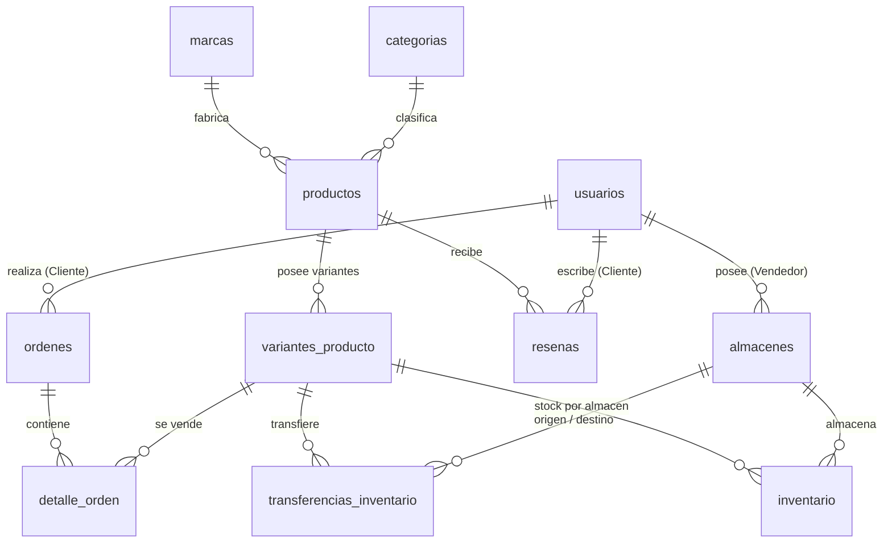

# E-Commerce Multivendedor REST API (Enterprise Edition)

Servidor **Backend REST API** desarrollado con **Node.js**, **Express.js**, **TypeORM** y **MySQL**. Cuenta con una arquitectura de base de datos empresarial que soporta marcas, SKUs universales, códigos de barras EAN-13, variantes de producto (tallas, colores, memoria), transferencias atómicas de stock con transacciones ACID, seguridad RBAC mediante **JWT / Firebase Auth** y documentación interactiva con **Swagger UI**.

---

## 🌟 Características Principales

*   **🏢 Arquitectura Multivendedor & Almacenes:** Gestión de sucursales físicas por vendedor.
*   **📦 Catálogo de Productos Enterprise:** Soporte para SKU único, código de barras EAN-13, SEO Slugs, marca fabricante y peso logístico (kg).
*   **🎨 Variantes de Productos:** Gestión de variantes por producto (RAM, Almacenamiento, Color, Talla) con atributos dinámicos en formato JSON.
*   **🚚 Transferencia Atómica de Inventario (ACID):** Transacciones atómicas pura en MySQL con TypeORM (`AppDataSource.transaction()`) para mover stock entre almacenes sin riesgo de inconsistencias.
*   **🔐 Autenticación & Autorización RBAC (JWT):** Middleware `authenticateJwt` y guardia `authorizeRoles` con 3 niveles de permisos (`CLIENTE`, `VENDEDOR`, `SUPERADMIN`).
*   **🛒 Órdenes & Checkout Híbrido:** Descuento de stock en tiempo real y soporte para pasarelas **PayPal** y **Pago Contra Entrega (COD)**.
*   **⭐ Reseñas & Calificaciones:** Evaluaciones de 1 a 5 estrellas por producto.
*   **📖 Documentación Interactiva Swagger UI:** Documentación OpenAPI 3.0 lista para probar en `http://localhost:4000/docs`.

---

## 📐 Esquema de Base de Datos Relacional (11 Tablas)



---

## 🚀 Instrucciones de Instalación y Ejecución

### 1. Requisitos Previos
*   **Node.js** v18+ y **npm**.
*   **MySQL Server** en ejecución (vía XAMPP, WAMP, Docker o MySQL Workbench) en el puerto `3306`.

### 2. Configurar Variables de Entorno (`.env`)
El archivo `.env` se encuentra en la raíz de `ecommerce-backend/`:
```env
PORT=4000
DB_HOST=127.0.0.1
DB_PORT=3306
DB_USER=root
DB_PASSWORD=
DB_NAME=ecommerce_db
JWT_SECRET=secreto_desarrollo_ecommerce_123
```

### 3. Instalar Dependencias
```bash
cd ecommerce-backend
npm install
```

### 4. Sembrar Datos de Prueba (Semilla Automática)
Ejecuta el script de semilla para inicializar la base de datos limpia y cargar 5 productos empresariales con SKU/variantes, 3 categorías, 5 marcas, 2 almacenes y usuarios de prueba:
```bash
npm run seed
```

### 5. Levantar el Servidor en Modo Desarrollo
```bash
npm run dev
```
El servidor se iniciará en `http://localhost:4000` y creará automáticamente cualquier tabla faltante.

---

## 📖 Documentación Swagger UI

Ingresa a la interfaz interactiva para probar los endpoints en vivo:
👉 **[http://localhost:4000/docs](http://localhost:4000/docs)**

---

## 📋 Referencia de Endpoints REST API (16+ Endpoints)

| Módulo | Método | Endpoint | Descripción | Autorización |
| :--- | :--- | :--- | :--- | :--- |
| **Auth** | `POST` | `/api/auth/dev-token` | Generar Token JWT de prueba firmado | Público |
| **Auth** | `POST` | `/api/auth/sync` | Sincronizar usuario de Firebase Auth con MySQL | JWT Autenticado |
| **Auth** | `GET` | `/api/auth/me` | Obtener datos y rol del usuario logueado | JWT Autenticado |
| **Categorías**| `GET` | `/api/categories` | Listar todas las categorías | Público |
| **Categorías**| `POST` | `/api/categories` | Crear nueva categoría | SuperAdmin |
| **Marcas** | `GET` | `/api/brands` | Listar todas las marcas comerciales | Público |
| **Marcas** | `POST` | `/api/brands` | Crear nueva marca | SuperAdmin |
| **Productos** | `GET` | `/api/products` | Catálogo global (Filtros por SKU, Barcode, Categoría, Marca) | Público |
| **Productos** | `GET` | `/api/products/:id` | Detalle completo con Variantes, Stock y Reseñas | Público |
| **Productos** | `POST` | `/api/products` | Crear nuevo producto con SKU base | Vendedor / SuperAdmin |
| **Productos** | `POST` | `/api/products/:id/variants` | Agregar variante (Color/Talla/RAM) a producto | Vendedor / SuperAdmin |
| **Productos** | `POST` | `/api/products/:id/reviews` | Publicar reseña y puntuación (1 a 5 estrellas) | Cliente |
| **Inventario**| `GET` | `/api/inventory/warehouses` | Listar todos los almacenes físicos | Público |
| **Inventario**| `GET` | `/api/inventory/my-warehouse` | Obtener inventario del almacén del vendedor | Vendedor / SuperAdmin |
| **Inventario**| `PUT` | `/api/inventory/stock` | Actualizar stock directo de una variante en un almacén | Vendedor / SuperAdmin |
| **Inventario**| `POST` | `/api/inventory/transfers` | Transferencia atómica de stock de variante (ACID) | Vendedor / SuperAdmin |
| **Órdenes** | `POST` | `/api/orders/checkout` | Procesar compra (PayPal o Pago Contra Entrega COD) | Cliente / SuperAdmin |
| **Órdenes** | `GET` | `/api/orders/my-orders` | Ver historial de compras del cliente logueado | Cliente / SuperAdmin |
| **Órdenes** | `GET` | `/api/orders/:id` | Obtener detalle completo de una orden e ítems | JWT Autenticado |

---

## 🔑 Credenciales y Tokens de Prueba Sembrados

Para probar en Swagger (`http://localhost:4000/docs`) o Postman, puedes usar el endpoint `/api/auth/dev-token` o pasar los siguientes IDs en el header `Authorization: Bearer <ID>`:

*   **SuperAdmin:** `superadmin-uid-100` *(Acceso total)*
*   **Vendedor Central:** `vendor1-uid-200` *(TechStore Bolivia / Almacén Central)*
*   **Vendedor Norte:** `vendor2-uid-300` *(ElectroHogar / Almacén Norte)*
*   **Cliente 1:** `client1-uid-400` *(María Vargas)*
*   **Cliente 2:** `client2-uid-500` *(Juan Pérez)*
